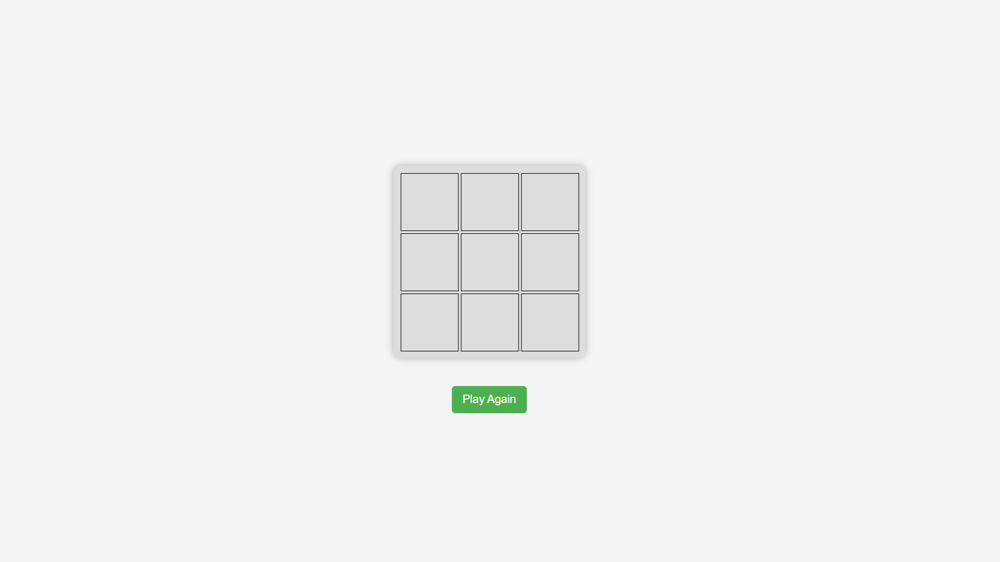
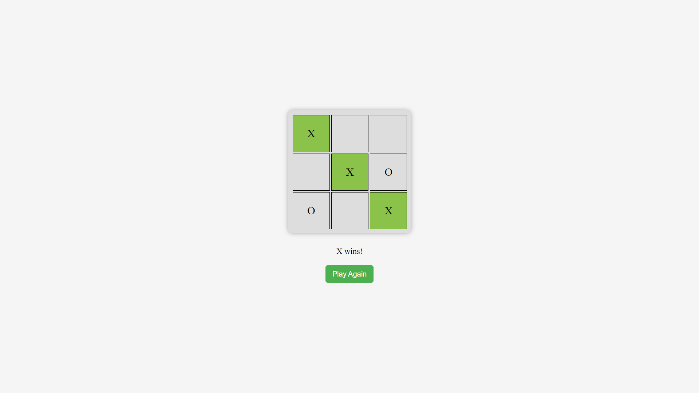
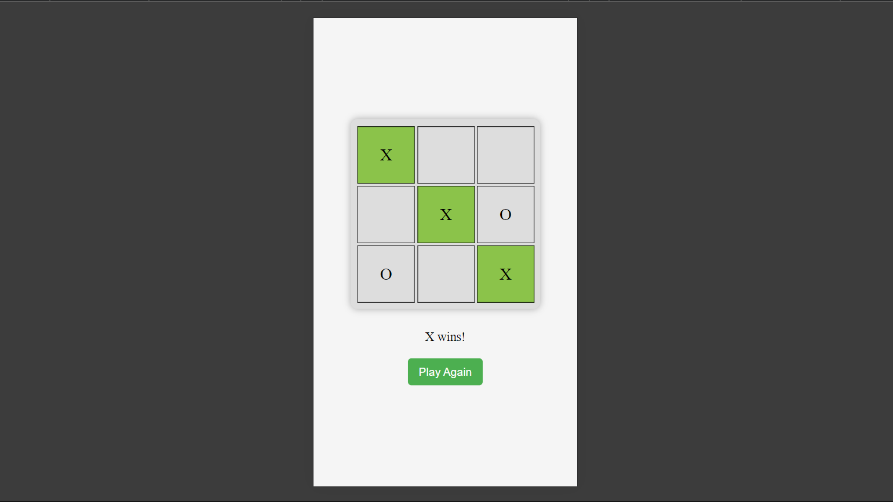

# Tic-Tac-Toe (XO) game



This is a simple Tic-Tac-Toe (XO) game implemented using HTML, CSS, and JavaScript. The game allows two players to play against each other on a 3x3 grid.

## Features

- **Responsive Design:** The game board adjusts to different screen sizes.
- **Interactive Game Board:** Players can click on cells to mark X or O.
- **Winner Highlight:** The winning combination of cells is highlighted with a green color.
- **Draw Detection:** If the game ends in a draw, a message is displayed.
- **Play Again:** A restart button is provided to reset the game and play again.

## Screenshots

### Desktop



### Mobile



## Files

- **index.html:** The main HTML file containing the structure of the game.
- **style.css:** The CSS file for styling the game board and elements.
- **script.js:** The JavaScript file that handles the game logic and interactivity.

## How to Play

1. Open the `index.html` file in your browser.
2. The first player clicks on any cell to place an "X".
3. The second player clicks on an empty cell to place an "O".
4. The game alternates between "X" and "O" until a player wins or the game ends in a draw.
5. If a player wins, the winning cells will be highlighted, and a message will appear.
6. Click the "Play Again" button to restart the game.

## Installation

To set up and run the XO Game on your local machine:

1. **Clone the Repository:**
   ```bash
   git clone https://github.com/Iqbolshoh/javascript-xo-game.git
   ```
2. **Navigate to the Project Directory:**
   ```bash
   cd javascript-xo-game
   ```
3. **Open the `index.html` File:**
   You can open the `index.html` file in any modern web browser to start playing the game. Simply double-click the file or open it using your browser's "Open File" option.

## Project Structure

- **index.html**: Contains the basic structure of the game and includes the linked CSS and JavaScript files.
- **style.css**: Styles the game board, cells, and buttons, providing a responsive layout and hover effects.
- **script.js**: Handles the game logic, including player turns, win detection, and game reset functionality.

## Technologies

<div style="display: flex; flex-wrap: wrap; gap: 5px;">
    
    
    
</div>

## Connect with Me

I love connecting with new people and exploring new opportunities. Feel free to reach out to me through any of the platforms below:

<table>
    <tr>
        <td>
            <a href="https://github.com/iqbolshoh">
                
            </a>
        </td>
        <td>
            <a href="https://t.me/iqbolshoh_777">
                
            </a>
        </td>
        <td>
            <a href="https://www.linkedin.com/in/iiqbolshoh/">
                
            </a>
        </td>
        <td>
            <a href="https://instagram.com/iqbolshoh_777" target="blank"></a>
        </td>
        <td>
            <a href="https://wa.me/qr/22PVFQSMQQX4F1">
                
            </a>
        </td>
        <td>
            <a href="https://x.com/iqbolshoh_777">
                
            </a>
        </td>
        <td>
            <a href="mailto:iilhomjonov777@gmail.com">
                
            </a>
        </td>
    </tr>
</table>

